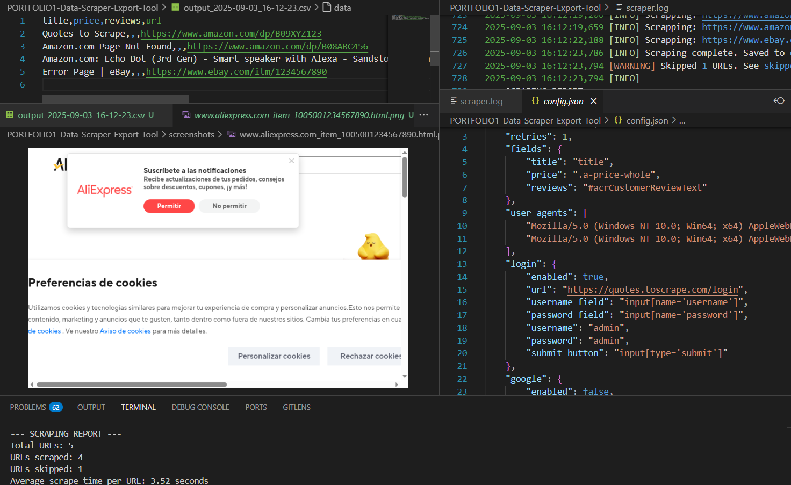

# WEB DATA SCRAPING (DEMO VERSION)

This is a flexible and easy to use **web scraping tool** built in Python.
This repo is just the **demo** of my scraping tool, created with the purpose of learning, testing and showing the capabilities of the tool.
With just one command, scrape structured data and export it to the format you prefer.

 

---

## ✨ Features (Demo Version)

- 📥 **CSV Input** → Provide a list of URLs to scrape.
- ⚙️ **Configurable fields** via `config.json` (set which elements to extract).
- 🧭 **Smart scraping** with Selenium + BeautifulSoup.
- 🎯 **Output Options**: CSV / Excel.
- 🔄 **Retries** → Automatically retries failed pages a customizable number of times.
- 📑 **Skipped URLs log** → URLs that couldn’t be scraped are saved to `skipped_report.csv`.
- 🕶 **Headless Mode** → Run without opening the browser.
- 🎲 **Random User-Agent Rotation** → Helps reduce detection.

---

## 🚀 Full Version Includes

- ✅ Wider range of supported input/output formats

- ✅ Advanced and customizable CLI and config.json settings

- ✅ New logger handler which redirects its output to a .log file

- ✅ Advanced anti-bot detection bypass

- ✅ Login automation

- ✅ Captcha handling (manual or automatic)

- ✅ Google sheets integration

- ✅ Database export (SQLite/Postgres)

- ✅ API export (send JSON via post)

- ✅ Scheduler / cron automation

- ✅ Dockerfile

- ✅ Proxy rotation
  

<br><br>📩 Contact me for the full tool or custom scrapers (Amazon, LinkedIn, competitor monitoring, lead generation).<br><br>
**NOTE: CUSTOM FEATURES CAN BE ADDED TO THE FINAL PRODUCT IN ORDER TO MEET THE CLIENTS NEEDS. THESE ARE JUST A LIST OF FEATURES ALREADY INCLUDED IN THE PREMIUM VERSION OF THE PRODUCT**

---

## 📦 Installation

Clone the repository and install dependencies:

```bash
git clone https://github.com/yourusername/web-data-scraper-demo.git
cd web-data-scraper-demo
pip install -r requirements.txt
```

Alternatively, run the 'run.sh' script

```bash
bash run.sh
```

---

## 🖥 Usage

```bash
python3 scraper.py input.csv --output excel --limit 5
```
**Arguments**

- input (required): Input file with URLs (CSV or Excel). Must contain a url column.
- --output (optional): Output format (csv or excel). Default = CSV.
- --limit: Scrape only first N URLs.

---

## ⚙️ Configuration

Edit config.json to define what to scrape:

```json
{
  "fields": {
    "title": "title",
    "price": ".price_color",
    "availability": ".instock.availability"
  },
  "headless": true,
  "proxy": null,
  "user_agents": [
    "Mozilla/5.0 (Windows NT 10.0; Win64; x64)",
    "Mozilla/5.0 (Macintosh; Intel Mac OS X 10_15_7)"
  ]
}
```

---

## 📢 Hire Me

💡 This demo shows the foundation.
I build custom web scrapers for:

- Small businesses

- Marketers

- Amazon/E-commerce sellers

- Lead generation agencies

<br>-- BASIC SCRAPER (NO EXTRAS): 50€<br>
-- PROFESSIONAL LEVEL SCRAPER: 100€ (WITH THE LISTED EXTRAS)<br>
-- PREMIUM EDITION SCRAPER: 100€-500€ (LISTED EXTRAS + CUSTOM CLIENT REQUESTED FEATURES)<br>

👉 Reach me on:<br>
  | [](https://www.linkedin.com/in/juanmanuelreyrojas)
  | [](https://www.upwork.com/freelancers/~0139afec838e1b0e09)
  | [](https://es.fiverr.com/s/GzWLpwL) 
  | [](mailto:jumareyrojas1@gmail.com)
  |

---

## 📜 License

This demo is provided for educational and portfolio purposes, it is not intended for scraping sites against their Terms of Service.
  
  


